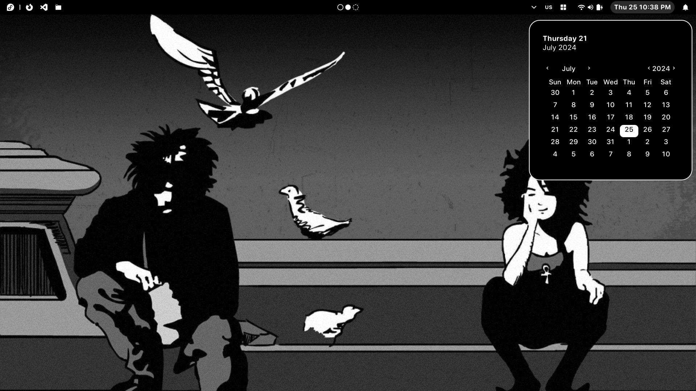
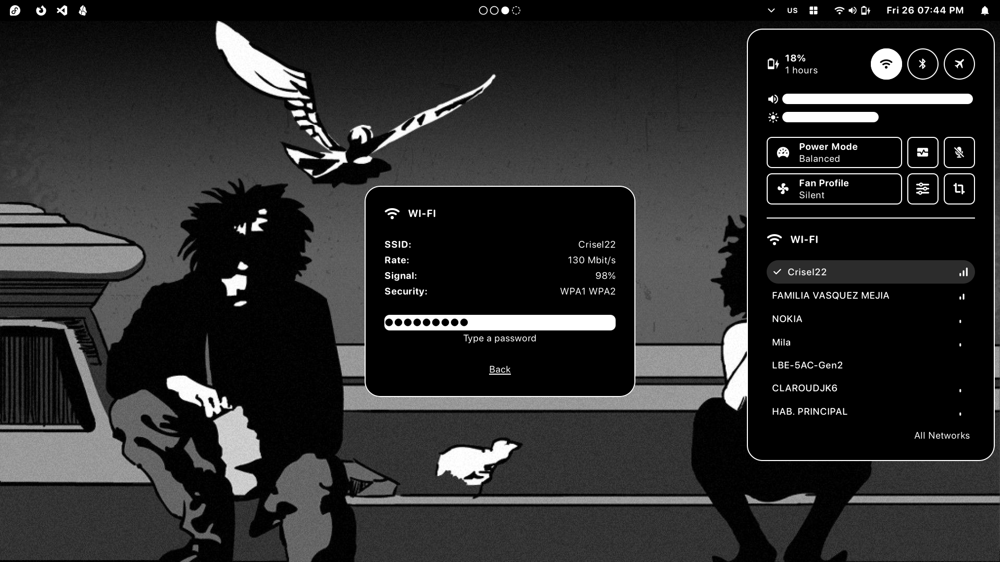
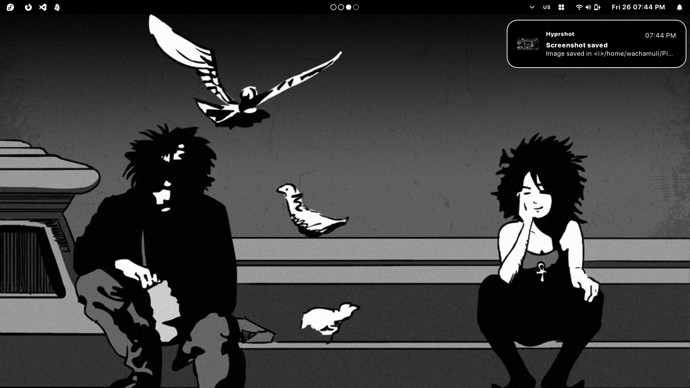
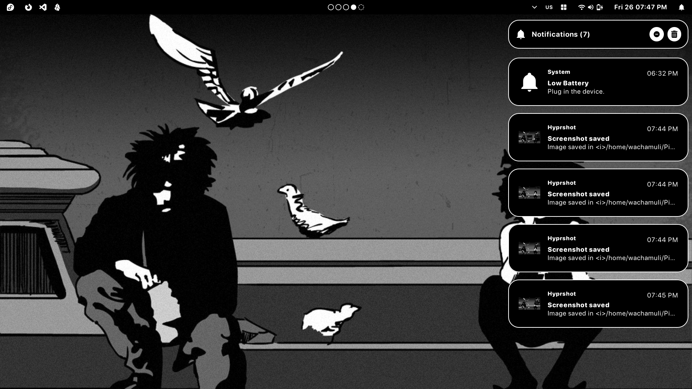
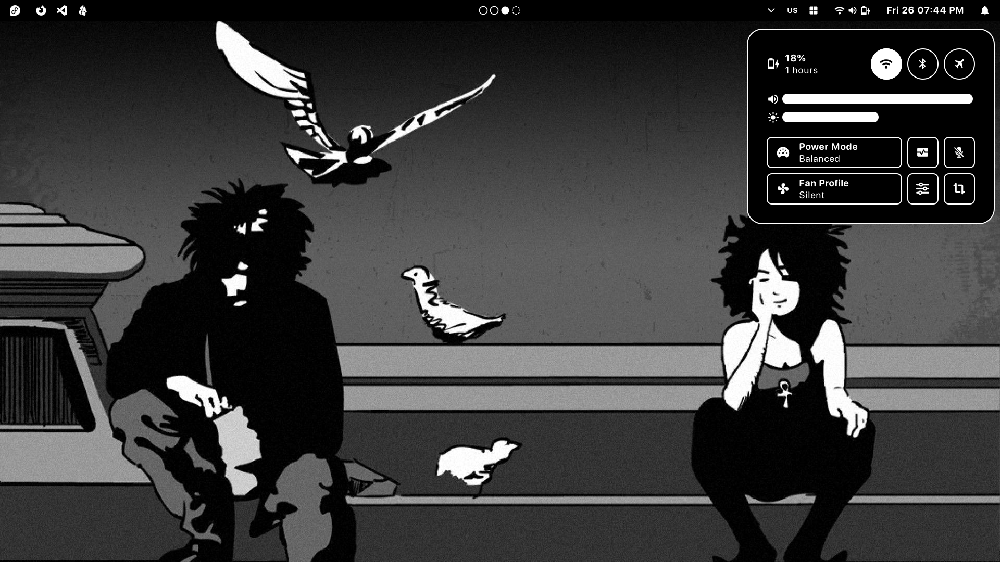
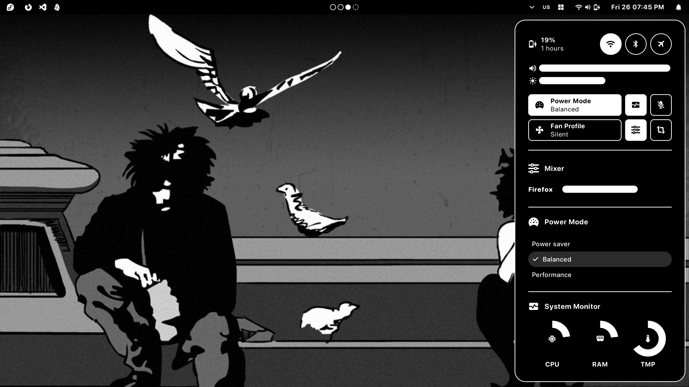
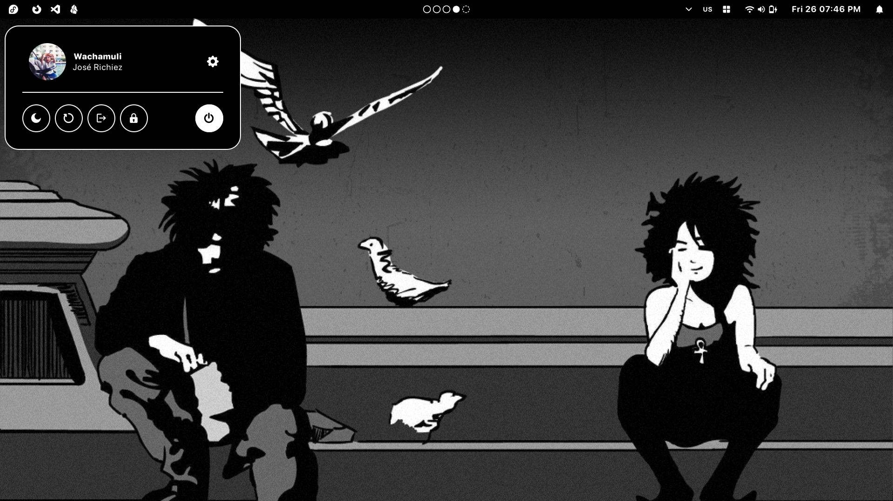

# Morpheus

Morpheus is a custom-built desktop environment designed to transform barebones Wayland compositors into a fully functional workstation. Built on top of Hyprland, it bridges the gap between a window manager and a complete Desktop Environment.

## Key Features

### Core Desktop Components

- **Control Panel**: A handy widget to control your system from one place.
- **Workspace Indicator**: Tracking of active and occupied workspaces.

- A **calendar**

- **Notification System**: A custom-built Python implementation that interfaces with the DBus notification spec to handle real-time system alerts.

### Integrated Control Center

A centralized hub for hardware and session management, including:

- **Network Manager**: GUI-driven WiFi and Ethernet configuration.

- **Audio Suite**: Master volume control and a granular Audio Mixer for per-app volume management.

- **Hardware Toggles**: Brightness control, Bluetooth toggles, and Keyboard layout switching.

- **Power Profiles**: Quick-switching between Performance, Balanced, and Power-saver modes.

- **Productivity**: Integrated Pomodoro timer and real-time System Monitor.

### Power Management

A dedicated Power Options Panel with secure handling for:

- Logout, Shutdown, Restart, Sleep, and Lockscreen.


## Tech Stack

- **Compositor**: Hyprland (Wayland)

- **UI Framework**: EWW (ElKowars widgets), uses GTK under the hood.

- **Communication**: DBus (Desktop Bus) for notification handling and system events.


- **Logic & IPC**: Bash (System automation) and Python (DBus bindings).

## Installation

1. Clone the repository:

```bash
git clone https://github.com/Wachamuli/eww-de.git
```

2. Move the file into the EWW configuration folder.

```
mv eww-de ~/.config/eww
```

3. Use `eww` to activate the designated widgets:

```
eww open-many bar notifications_window
```

**Pro tip**: Use `eww list-windows` to list all available windows. 

## Showcase
















